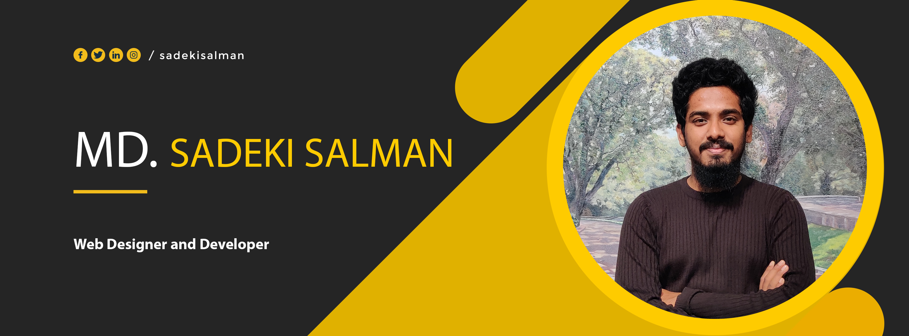
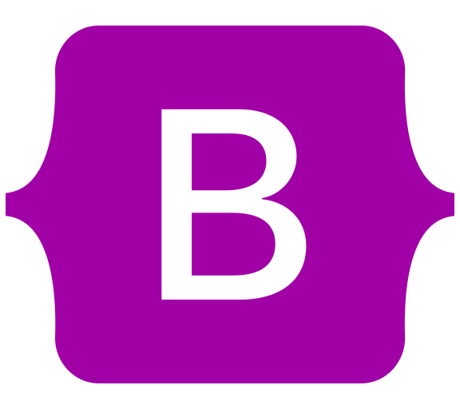
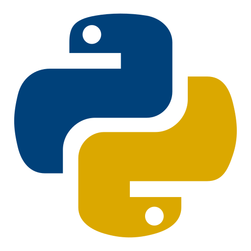

<!-- Banner -->

<h1> Hello, I'm Md. Sadeki Salman </h1>
<h4>Web Designer & Developer | WordPress Expert </h4>  
 
<!-- /Banner -->

<!-- Contact me -->

[][facebook]
[][linkedin]
[][twitter]
   

<!-- /Contact me -->

<!-- About me -->

## About Me

I'm a <b>computer science and engineering</b> student. I am well-versed in web development, programming languages, and other topics relevant to computer science. I have experience creating <b>WordPress websites</b>. I'm improving my web development abilities. I want to learn something new every day and impart my expertise to others.

  

<!-- /About me -->

<!-- Key skills -->

## My Skills 

  <h4> Key Skills: </h4>
  
  
  
  
  

<!-- /Key skills  -->

<!-- Other skills  -->

  <h4> Other Skills: </h4>
  

    

<!-- /Other skills  --> 

<!-- GitHub stats -->

## GitHub Status
 

   

<!-- /GitHub stats -->

<!-- Education -->

## Education

| Degree | | Institute                         | | Location            |  
| ------ |-| ---------                         |-| --------            |    
| B.Sc   | | Daffodil International University | | Dhaka, Bangladesh   |
| HSC    | | Police Lines School and College   | | Rangpur, Bangladesh |
| SSC    | | Ideal Public School               | | Rangpur, Bangladesh |

 

<!-- /Education -->

<!-- Languages -->
## Languages

| Language |  | Proficiency  |
| -------- |--|-----------   |
| Bangla   |  | Native       |
| English  |  | Advanced     |
| Hindi    |  | Intermediate |

 
<!-- /Languages -->

<!-- Sports & Activities -->

## Sports & Activities

- 🏏 Cricket ⚽ Football 🏸 Badminton
- 🚶‍♂️ Walking ✈️ Travelling

  
<!-- /Sports & Activities -->

<!-- Footer -->
---

___Thanks for going through my Portfolio.___

---
<!-- /Footer -->

<!-- Links -->

[facebook]: https://web.facebook.com/mdsadekisalman
[linkedin]: https://www.linkedin.com/in/sadekisalman/
[twitter]: https://twitter.com/sadekisalman/

<!-- /Links -->
